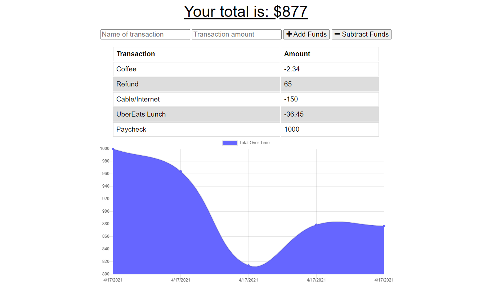

# BudgetTracker

## Description

This app gives avid travellers the ability to track their withdrawals and deposits with or without a data/internet connection
so that their account balance is accurate while traveling.

## Screenshot

## Table of Contents 

* [Installation](#installation)
* [Usage](#usage)
* [Demo](#demo)
* [License](#license)

## Installation

Clone or download and run `npm install`

## Usage

To start the server run `npm start`. Users can track their income and spending and be shown a graph of their cashflow over time. As a progressive web app it may be installed on your phone or desktop and transactions made offline will be synced with the server when the device comes back online. 

## Demo
A live demo of this project is deployed at: https://bluesatyr-budget-tracker.herokuapp.com/

## License

This project uses the MIT License. More info about this license can be found at https://opensource.org/licenses/MIT
    
## Questions

For additional information on this project contact me by email at shawnevans.music@gmail.com or visit my GitHub page at https://github.com/bluesatyr.

